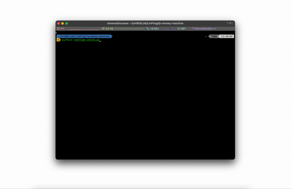

<p align="center">
  <a href="https://github.com/montali/lp-money-machine">
    
  </a>
  <h1 align="center">LP Money Machine</h1>
  <p align="center">
    Stock portfolio optimizer.
  </p>

</p>

This project shows the application of a **Nelder-Mead optimization algorithm** to the well-known stock portfolio optimization problem. The original Nelder-Mead procedure has been enhanced to cope with the only portfolio constraint: stocks have to sum up to 100%.

<p align="center">
    
</p>

## Stock risk and prediction

What we'd like to have is a prediction of what a good investment would be. For an investment to be _good_, we'd like it to be **profitable** and **safe** (kinda), so we'll want to minimize risk, while maximizing profit. A simple objective function would therefore be:

<!-- $$
\textrm{Maximize }\sum_{i=0}^{N}\frac{\textrm{return}_i}{\textrm{risk}_i}
$$ -->

<div align="center"></div>
or better, since the created Nelder-Mead optimization is a minimization technique:

<!-- $$
\textrm{Minimize }\sum_{i=0}^{N}-\frac{\textrm{return}_i}{\textrm{risk}_i}
$$ -->

<div align="center"></div>

## Nelder-Mead

**Nelder-Mead** is an iterative simplex optimization method, which works through for operations: **reflection**, **expansion**, **contraction**, **shrinkage**. These are usually tried in this order. Basically, what they do is the following:

- **Reflection**: tries moving the simplex away from the sub-optimal area, by computing the reflected point through the centroid of the other points, excluding the worst one;
- **Expansion**: if reflection generated a point which is better than the current best, the point is moved along the same direction for a bit further;
- **Contraction**: if, on the contrary, the reflected point did not improve the result, we'll want to _contract_ the simplex towards the best point;
- **Shrinkage**: if none of the previous did work, we'll want to re-calculate all the points except for the best one, computing them through the best one's coordinates.

### Simplex initialization

Several solutions have been proposed to create the initial simplex. This implementation uses a popular one (used in the MATLAB implementation too): after selecting the initial point (randomly), the others are created using the _i-th_ dimension unit vector <!-- $u_i$ --> :

<!-- $$
x_{(i+1)}=x_{1}+h\left(x_{1}, i\right) * u_{i}
$$ -->

<div align="center"></div>
where <!-- $h$ -->  is a shift coefficient equal to <!-- $0.05$ -->  if the coefficient of <!-- $u_i$ -->  in the definition of <!-- $x_1$ -->  is non-zero, <!-- $0.025$ -->  otherwise.

### Constraints

Nelder-Mead is an **unconstrained method**. To cope with the portfolio constraint, I introduced a **_fixing_ function** that rescales the results to a percentage.

### Termination

The termination is decided basing on the **standard deviation** of the values of the points, and a **maximum number of iterations**.

### Hyperparameters

Hyperparameter tuning and a little bit of research led to the following parameters:

- <!-- $\textrm{reflection}_\textrm{param}=1$ --> 
- <!-- $\textrm{expansion}_\textrm{param}=2$ --> 
- <!-- $\textrm{shrinkage}_\textrm{param}=0.5$ --> 
- <!-- $\textrm{max}_\textrm{iter}=50$ --> 
- <!-- $\textrm{shift}_\textrm{coeff}=0.05$ --> 
- <!-- $\sigma=0.00001$ --> 

## Stock data retrieval and predictions

Stock data are retrieved from **AlphaVantage**, a free API that provides real-time stock data.

Timeseries prediction has been added to work on predicted data and not historical data only, using a **Temporal Convolutional Network** implemented in [**Darts**](https://github.com/unit8co/darts).

## How to use me

First, install the requirements through pip:

```bash
$> pip install -r requirements.txt
```

Then, add your API secret to the code of `realtime_stocks.py` and run it:

```bash
$> python realtime_stocks.py
```

Different scripts are available:

- `run_me.py` is the purest version: it uses the historical data contained in `all_stocks_5yr.csv` to create a portfolio;
- `realtime_stocks.py` is instead able to work on real data: it downloads the history of stocks values from AlphaVantage, then analyzes them through Darts and outputs an optimal portfolio;
- `nelder_mead.py` is where the optimization is done: it provides an implementation of the Nelder-Mead iterative optimization technique, using a simplex;
- `tester.py` provides a backtesting script that is able to test the techniques found in `realtime_stocks.py` to actually see if they work.

That's it!
